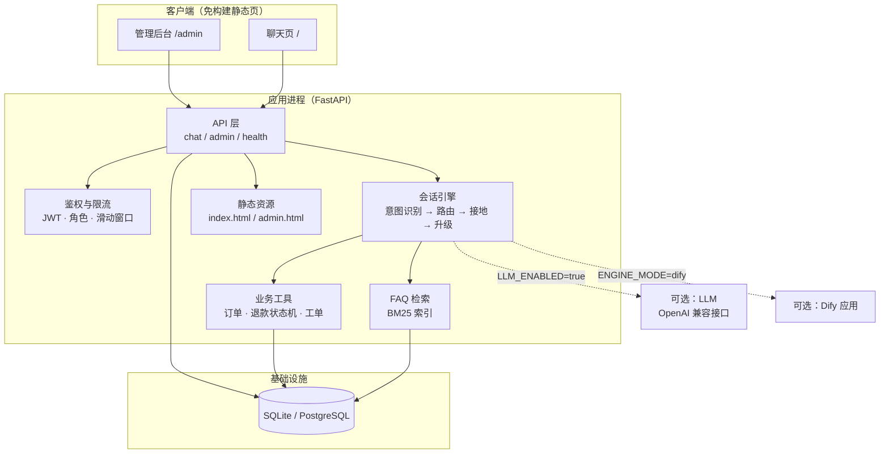

# AI 智能客服平台

> 一个开箱即用的生产级智能客服系统：多轮上下文对话 · FAQ 知识库检索 · 意图识别 · 自动转人工 · 对话持久化 · 管理后台。

基于原 Dify 客服原型项目重构而成。原项目把编排能力全部托管给外部 Dify 实例，必须先部署 Dify、配置 API Key 才能跑起来；本项目把编排引擎内聚到应用内部，**克隆后无需任何外部依赖即可直接运行**，同时保留了 Dify 接入通道（`ENGINE_MODE=dify`）作为可选的编排后端。

---

## 目录

- [核心能力](#核心能力)
- [系统架构](#系统架构)
- [快速开始](#快速开始)
- [配置说明](#配置说明)
- [使用指南](#使用指南)
- [工作原理](#工作原理)
- [API 接口](#api-接口)
- [数据模型](#数据模型)
- [测试](#测试)
- [Docker 部署](#docker-部署)
- [可选集成：LLM 与 Dify](#可选集成llm-与-dify)
- [生产部署清单](#生产部署清单)
- [项目结构](#项目结构)
- [设计取舍](#设计取舍)

---

## 核心能力

| 需求 | 实现方式 |
| --- | --- |
| **多轮上下文对话** | 每轮对话从数据库重建上下文窗口；引擎从历史消息中抽取并记忆槽位（订单号、工单号、退款单号），后续追问可直接复用。例如先说「帮我查订单 ORD-1001」，再问「那这个能退吗」，系统会自动关联到 ORD-1001。 |
| **FAQ 知识库检索问答** | 内置 BM25 检索（纯 Python 实现，无第三方依赖），中文采用「单字 + 二元组」分词，无需 jieba。所有回答都携带命中的知识库条目作为引用来源；知识库改动后索引自动重建，无需重启。 |
| **意图识别（退款 / 订单查询 / 技术支持）** | 加权关键词规则打分 + 上下文平滑（短追问继承上一轮意图）+ 槽位线索；可选叠加 LLM 兜底分类。规则完全本地运行，模型不可用也不影响识别。 |
| **无法解决时自动转人工** | 三级触发：用户显式要求（「转人工」/「投诉」）→ 立即转接；连续 N 轮未解决（无法命中知识库且无工具结果）→ 自动升级；意图置信度过低 → 升级。转接时生成人工工单，并附带意图、置信度、关联订单与最后一句话。 |
| **对话历史持久化** | SQLAlchemy ORM 落库（默认 SQLite，可无缝切换 PostgreSQL）。`messages` 表为只追加的完整会话流水，`conversations` 表保存派生状态（主意图、消息数、转人工次数、满意度），管理后台直接查询。 |
| **管理后台** | 免构建单页控制台：概览看板（会话量 / 消息量 / 平均满意度 / 转人工率 / 趋势图 / 意图分布）、对话记录检索与全文回看、人工工单队列（可直接回复用户）、退款审核、FAQ 知识库增删改查。 |

补充能力：

- **退款人工审核闭环** —— 智能客服只能*提交*退款申请，必须由管理员审批后才能执行，且审批结果只能被消费一次。防止模型幻觉或重放直接动钱。
- **满意度评价** —— 会话达到一定轮数后客户端提示评分（1–5 星 + 评论），后台聚合出平均分、好评率、差评率与分布。
- **流式输出** —— `POST /api/chat/stream` 以 SSE 分段推送意图元信息与回答内容。
- **越权隔离** —— 订单归属、会话归属在服务端强制校验，用户只能访问自己的数据。

---

## 系统架构



### 一轮对话的处理流水线

```text
用户消息
  │
  ├─ 1. 持久化用户消息
  ├─ 2. 意图识别（规则打分 → 可选 LLM 兜底）
  ├─ 3. 槽位抽取 + 合并历史上下文
  ├─ 4. 按意图路由
  │      ├─ 订单查询 → 校验订单归属 → 返回状态与物流
  │      ├─ 退款     → 创建退款申请（pending_review，等待人工审核）
  │      ├─ 技术支持 → 检索知识库；未命中则创建工单
  │      └─ 常见问题 → 检索知识库，可选由 LLM 改写为自然回答
  ├─ 5. 升级判定（未接地 / 低置信度 → 转人工）
  └─ 6. 持久化助手回复 + 更新会话状态
```

**接地（grounding）原则**：助手说的每一句话都必须来自检索到的知识库条目或确定性工具返回结果。两者都没有时，引擎选择升级到人工，而不是编造答案。

---

## 快速开始

### 环境要求

- Python 3.11+
- 无需数据库、无需 Redis、无需外部 API Key

### 三步启动

```bash
# 1. 安装依赖
python -m pip install -r requirements.txt

# 2. （可选）加载演示账号、订单与 FAQ 知识库
#    应用首次启动时也会自动完成这一步
python scripts/seed.py --with-demo-chats 14

# 3. 启动服务
python -m uvicorn app.main:app --reload --port 8000
```

启动后访问：

| 入口 | 地址 | 说明 |
| --- | --- | --- |
| 用户聊天页 | http://localhost:8000 | 多轮对话、流式回答、满意度评价 |
| 管理后台 | http://localhost:8000/admin | 默认账号 `admin` / `admin123` |
| 接口文档 | http://localhost:8000/docs | 自动生成的 OpenAPI 交互文档 |
| 健康检查 | http://localhost:8000/api/healthz | 存活探针 |

### 试用建议

在聊天页依次输入以下内容，可以完整走通全部能力：

```text
1. 帮我查一下订单 ORD-1001 的物流        → 订单查询意图
2. 那这个订单能退款吗                     → 复用上文订单号，创建退款申请
3. App 一直闪退打不开怎么办               → 技术支持意图 + 知识库排查步骤
4. 怎么开发票？                           → FAQ 检索问答（带引用来源）
5. 我要转人工                             → 触发人工工单
6. zzqqxx wwvvuu                          → 连续两轮未解决后自动转人工
```

然后打开管理后台 → **人工工单** 回复用户，→ **退款审核** 审批第 2 步产生的申请，→ **概览看板** 查看满意度统计。

> 聊天页左下角点击用户卡片可切换身份（`user001` / `user002` / `user003`），便于演示数据隔离。

---

## 配置说明

所有配置均可通过环境变量或 `.env` 文件提供（复制 `.env.example` 为 `.env`）。**每一项都有安全的开发默认值，因此空 `.env` 也能启动。**

### 应用与存储

| 变量 | 默认值 | 说明 |
| --- | --- | --- |
| `ENVIRONMENT` | `development` | 设为 `production` 时会启用配置安全校验 |
| `LOG_LEVEL` | `INFO` | 日志级别 |
| `DATABASE_URL` | `sqlite:///./data/app.db` | 支持 `sqlite:///...` 与 `postgresql+psycopg://...` |
| `AUTO_SEED` | `true` | 首次启动自动加载演示账号、订单与 FAQ |

### 会话引擎

| 变量 | 默认值 | 说明 |
| --- | --- | --- |
| `ENGINE_MODE` | `builtin` | `builtin` 使用内置引擎；`dify` 交由外部 Dify 应用编排 |
| `HANDOFF_CONFIDENCE_THRESHOLD` | `0.35` | 低于该置信度时升级处理 |
| `HANDOFF_MAX_FALLBACK_TURNS` | `2` | 连续多少轮未解决后自动转人工 |
| `FAQ_TOP_K` | `3` | 注入的 FAQ 片段数量 |
| `FAQ_MIN_SCORE` | `1.2` | BM25 命中阈值，低于该分数视为未命中 |
| `RATE_LIMIT_PER_MINUTE` | `60` | 单用户每分钟请求上限 |

### 鉴权

| 变量 | 默认值 | 说明 |
| --- | --- | --- |
| `AUTH_MODE` | `dev` | `dev` 信任 `X-User-Id` 请求头（仅本地）；`jwt` 要求 Bearer Token |
| `JWT_SECRET` | `dev-only-change-me` | 生产环境必须替换为 ≥32 位随机串 |
| `JWT_ISSUER` | `cs-agent-platform` | Token 签发者 |
| `JWT_EXPIRE_MINUTES` | `720` | Token 有效期 |
| `ADMIN_USERNAME` / `ADMIN_PASSWORD` | `admin` / `admin123` | 管理后台账号，生产环境必须修改 |

### 可选集成

| 变量 | 默认值 | 说明 |
| --- | --- | --- |
| `LLM_ENABLED` | `false` | 开启后使用 LLM 兜底分类与回答改写 |
| `LLM_BASE_URL` / `LLM_API_KEY` / `LLM_MODEL` | — | OpenAI 兼容接口地址、密钥与模型名 |
| `DIFY_BASE_URL` / `DIFY_API_KEY` | — | `ENGINE_MODE=dify` 时必填 |

---

## 使用指南

### 用户聊天页（`/`）

- 左侧为历史会话列表，点击可回看任意会话的完整记录；「新建会话」开启新一轮。
- 助手消息下方显示**意图标签**、**置信度**与**知识库引用来源**，可直观看到答案的依据。
- 输入「转人工」随时转接人工客服；转接后页面显示提示条。
- 会话进行到一定轮数后出现**满意度评分**（1–5 星），提交后写入统计。
- 支持 `Enter` 发送、`Shift+Enter` 换行，回答以流式方式逐段呈现。

### 管理后台（`/admin`）

| 页面 | 功能 |
| --- | --- |
| **概览看板** | 会话总数、消息总数、平均满意度、转人工率、待处理工单 / 待审核退款；满意度分布、意图分布、近 7/14/30 天会话趋势 |
| **对话记录** | 按关键词（标题 / 用户 / 消息内容）、意图、状态、是否转人工筛选；分页浏览；点击行查看完整对话流水，含每轮意图、置信度、引用来源 |
| **人工工单** | 查看待处理 / 已回复 / 已解决的转人工请求，包含系统生成的摘要（意图、原因、关联订单、用户最后一句）；可直接回复用户或标记已解决 |
| **退款审核** | 查看退款申请队列，审批通过并执行或拒绝，填写审核备注 |
| **FAQ 知识库** | 新增 / 编辑 / 删除 / 启停 FAQ 条目，支持按问题与关键词检索；变更后检索索引自动重建 |

---

## 工作原理

### 意图识别

意图识别采用**确定性优先、模型兜底**的两段式设计：

1. **加权关键词打分** —— 每个意图维护一份「短语 → 权重」字典。权重编码信号强度：`退款`（2.4）远强于裸字 `退`；`转人工`（3.4）直接判定为最高优先级。
2. **上下文平滑** —— 短消息（≤20 字）若与上一轮意图重叠，对该意图加权 1.25 倍；完全无关键词的短追问（≤12 字）直接继承上一轮意图。
3. **槽位线索** —— 消息中出现订单号但未匹配到任何意图时，判定为订单查询。
4. **置信度计算** —— 由「主导度」（最高分 / 总分）与「信号强度」（最高分 / 3.0）加权得出，范围约 0.15–0.97。
5. **LLM 兜底** —— 仅当置信度低于阈值且 `LLM_ENABLED=true` 时才调用模型，失败则回退规则结果。

规则部分完全本地运行，因此**模型不可用、断网、超时都不会影响意图识别的可用性**。

### FAQ 检索

内置 BM25（`k1=1.5`, `b=0.75`）实现：

- **分词**：ASCII 串按小写词切分；中文同时索引单字与二元组（bigram）。这样无需分词词典也能获得良好召回。
- **字段加权**：问题字段重复 3 次、关键词字段重复 2 次、答案字段 1 次，使问题级匹配优先于正文中的偶然提及。
- **短语加成**：查询与 FAQ 问题互为子串时额外加 2.5 分。
- **索引缓存**：以 `(条目数, 最新更新时间)` 作为指纹缓存索引，知识库变更后下一次查询自动重建。

### 转人工策略

| 触发条件 | `handoff_reason` | 行为 |
| --- | --- | --- |
| 用户显式要求（转人工 / 人工客服 / 投诉 等） | `user_requested` | 立即创建人工工单 |
| 连续 N 轮未接地（`HANDOFF_MAX_FALLBACK_TURNS`） | `unresolved` | 创建人工工单并提示已转接 |
| 意图置信度过低且无法接地 | `unresolved` | 同上 |
| Dify 编排信号或调用失败 | `dify_signal` / `dify_unavailable` | 降级到知识库回答，必要时转人工 |

转接时系统生成工单摘要，人工客服无需用户重复描述即可接手；回复内容以 `agent` 角色写入同一会话，用户侧即时可见。

### 退款安全模型

```text
智能客服                         管理员                      业务状态机
   │                               │                            │
   ├─ 提交退款申请 ────────────────►│                            │
   │  (pending_review)             │                            │
   │                               ├─ 审批通过 ─────────────────►│
   │                               │  (approved)                │
   │                               │                            ├─ 执行退款（仅一次）
   │                               │                            │  (executed)
   │◄──────────────────────────────┴────────────────────────────┤
```

关键约束：

- 助手只能创建 `pending_review` 状态的申请，**永远不能自行批准**。
- `approved → executed` 通过条件 UPDATE 实现，重复调用匹配 0 行，审批结果不可能被消费两次。
- 执行前重新校验订单归属与可退款状态，不信任任何来自模型侧的参数。

---

## API 接口

完整交互式文档见 `/docs`。以下为核心接口摘要。

### 用户侧

| 方法 | 路径 | 说明 |
| --- | --- | --- |
| `POST` | `/api/chat` | 发送消息，返回结构化回答（意图、置信度、引用、工单/申请号） |
| `POST` | `/api/chat/stream` | 同上，以 SSE 流式返回 `meta` / `delta` / `done` 事件 |
| `GET` | `/api/conversations` | 当前用户的历史会话列表 |
| `GET` | `/api/conversations/{id}` | 会话详情（含完整消息流水） |
| `DELETE` | `/api/conversations/{id}` | 删除会话 |
| `POST` | `/api/conversations/{id}/close` | 结束会话 |
| `POST` | `/api/conversations/{id}/satisfaction` | 提交满意度评分（1–5 分 + 评论） |
| `GET` | `/api/me` | 当前用户资料与最近订单 |

### 管理侧

| 方法 | 路径 | 说明 |
| --- | --- | --- |
| `POST` | `/api/admin/login` | 管理员登录，返回 Bearer Token |
| `GET` | `/api/admin/stats/overview` | 概览统计 |
| `GET` | `/api/admin/stats/satisfaction` | 满意度统计与分布 |
| `GET` | `/api/admin/stats/intents` | 意图分布 |
| `GET` | `/api/admin/stats/trend?days=14` | 会话 / 消息 / 满意度趋势 |
| `GET` | `/api/admin/conversations` | 对话记录检索（支持 `q` / `intent` / `status` / `handoff_only` / 分页） |
| `GET` | `/api/admin/conversations/{id}` | 完整对话流水 |
| `GET` | `/api/admin/handoffs` | 人工工单队列 |
| `POST` | `/api/admin/handoffs/{id}/reply` | 以人工客服身份回复用户 |
| `POST` | `/api/admin/handoffs/{id}/resolve` | 标记工单已解决 |
| `GET` | `/api/admin/refunds` | 退款申请队列 |
| `POST` | `/api/admin/refunds/{id}/review` | 审批退款（通过并执行 / 拒绝） |
| `GET` | `/api/admin/faqs` | FAQ 列表 |
| `POST` `PUT` `DELETE` | `/api/admin/faqs[/{id}]` | FAQ 增删改 |
| `POST` | `/api/admin/faqs/reindex` | 手动重建检索索引 |

### 调用示例

```bash
# 用户提问（开发模式下用 X-User-Id 标识身份）
curl -X POST http://localhost:8000/api/chat \
  -H 'Content-Type: application/json' \
  -H 'X-User-Id: user001' \
  -d '{"message": "帮我查一下订单 ORD-1001 的物流"}'

# 管理员登录
TOKEN=$(curl -s -X POST http://localhost:8000/api/admin/login \
  -H 'Content-Type: application/json' \
  -d '{"username":"admin","password":"admin123"}' | python -c 'import sys,json;print(json.load(sys.stdin)["access_token"])')

# 查看满意度统计
curl http://localhost:8000/api/admin/stats/satisfaction -H "Authorization: Bearer $TOKEN"
```

---

## 数据模型

| 表 | 说明 |
| --- | --- |
| `users` | 用户账号（等级、状态） |
| `orders` | 订单（归属用户、金额、状态、是否可退款） |
| `conversations` | 会话派生状态：主意图、消息数、未解决计数、转人工次数、上下文槽位（JSON）、满意度评分与评论 |
| `messages` | 只追加的完整消息流水：角色（user / assistant / agent / system）、内容、意图、置信度、引用来源（JSON）、是否触发转人工、耗时 |
| `refund_proposals` | 退款申请状态机：`pending_review → approved / rejected → executed` |
| `tickets` | 技术支持工单 |
| `handoff_tasks` | 人工工单：触发原因、系统摘要、处理人、状态、解决时间 |
| `faq_entries` | FAQ 知识库条目（分类、问题、答案、关键词、启用状态） |
| `audit_events` | 审计事件（退款申请 / 审批 / 执行、转人工、工单创建等） |

---

## 测试

```bash
# 单元测试与接口测试（104 项）
python -m pytest

# 前端一致性检查：核对 JS 引用的元素 id 与静态资源是否真实存在（需 node）
node scripts/check_frontend.mjs

# 端到端冒烟测试（需先启动服务，32 项检查）
python -m uvicorn app.main:app --port 8000 &
python scripts/smoke_test.py --base-url http://127.0.0.1:8000
```

测试覆盖：意图识别（含中文多场景与上下文继承）、BM25 检索与索引失效、引擎路由与多轮槽位记忆、自动转人工与计数器重置、退款状态机（含审批不可重放）、对话持久化与越权隔离、满意度评价、管理后台鉴权与全部统计接口、FAQ 增删改查与即时生效。

前端为免构建方案，因此额外提供静态一致性检查：由于没有打包器，元素 id 拼写错误只会在浏览器里表现为运行时崩溃，该脚本会把 JS 中的 `$('id')` 查找、`addEventListener` 绑定目标与静态资源引用逐一对照 HTML 校验。CI 中三个 job（测试 / 前端检查 / 冒烟测试）均会执行。

---

## Docker 部署

```bash
# 默认：单容器 + SQLite，一条命令即可运行
docker compose up -d --build

# 生产推荐：追加 PostgreSQL
docker compose --profile postgres up -d --build
```

访问 `http://localhost:8000`。数据持久化在 `app_data` 卷中。

如需反向代理（含 SSE 免缓冲配置），参见 `deploy/nginx.conf`。

---

## 可选集成：LLM 与 Dify

### 接入 LLM

```bash
LLM_ENABLED=true
LLM_BASE_URL=https://api.openai.com/v1
LLM_API_KEY=sk-...
LLM_MODEL=gpt-4o-mini
```

开启后 LLM 承担两件**边界明确**的工作：低置信度时的意图兜底分类，以及把检索到的接地内容改写为更自然的回答。任何超时、HTTP 错误或返回格式异常都会静默回退到确定性路径，**模型故障不会导致会话失败**。

### 切换为 Dify 编排

```bash
ENGINE_MODE=dify
DIFY_BASE_URL=https://api.dify.ai/v1
DIFY_API_KEY=app-...
```

`app/core/dify_adapter.py` 实现了与内置引擎一致的 `handle()` 契约，因此对话持久化、管理后台、满意度统计与转人工队列全部照常工作。Dify 侧的会话 ID 保存在 `conversations.context` 中以维持多轮连续性；若 Dify 不可用，会自动降级到知识库回答并在必要时转人工。

---

## 生产部署清单

1. `ENVIRONMENT=production` —— 应用会拒绝启动，直到所有占位密钥被替换。
2. 设置强随机 `JWT_SECRET`（≥32 位，可用 `openssl rand -hex 32` 生成）。
3. 修改 `ADMIN_USERNAME` / `ADMIN_PASSWORD`。
4. `AUTH_MODE=jwt` —— 由你的网关或 SSO 签发 Token。
5. `DATABASE_URL` 指向 PostgreSQL，并配置定期备份。
6. `AUTO_SEED=false`，避免生产环境写入演示数据。
7. 按需调低 `RATE_LIMIT_PER_MINUTE`，并在反向代理层再做一层限流。
8. 将 `/api/admin` 限制在内网或接入 VPN。
9. 为 `/api/chat/stream` 配置反向代理关闭缓冲（`proxy_buffering off`），否则流式输出会被攒批。

---

## 项目结构

```text
cs-agent-platform/
├── app/
│   ├── main.py                # FastAPI 入口、中间件、静态资源挂载
│   ├── config.py              # 配置与生产环境安全校验
│   ├── database.py            # 引擎 / 会话 / 建表（SQLite 与 PostgreSQL 通用）
│   ├── models.py              # ORM 模型
│   ├── schemas.py             # 请求 / 响应契约
│   ├── security.py            # PBKDF2 密码哈希、HS256 Token、用户与管理员鉴权
│   ├── rate_limit.py          # 进程内滑动窗口限流
│   ├── api/
│   │   ├── chat.py            # 对话、流式、历史、满意度
│   │   ├── admin.py           # 统计、对话记录、工单、退款、FAQ
│   │   └── health.py          # 存活 / 就绪探针
│   ├── core/
│   │   ├── intent.py          # 意图识别与槽位抽取
│   │   ├── faq.py             # BM25 检索与索引缓存
│   │   ├── engine.py          # 会话引擎（编排、接地、升级）
│   │   ├── llm.py             # 可选 LLM 适配（失败即降级）
│   │   ├── dify_adapter.py    # 可选 Dify 编排适配
│   │   └── factory.py         # 引擎选择
│   ├── tools/
│   │   └── business.py        # 订单、退款状态机、工单、审计、种子数据
│   └── static/                # 免构建前端（index.html / admin.html / *.js / style.css）
├── data/faq.json              # FAQ 知识库种子数据
├── scripts/
│   ├── seed.py                # 初始化演示数据（可生成带评分的演示会话）
│   ├── smoke_test.py          # 端到端冒烟测试
│   └── check_frontend.mjs     # 前端元素 id / 静态资源一致性检查
├── tests/                     # 104 项单元与接口测试
├── deploy/                    # Nginx 配置与生产环境变量模板
├── docs/                      # 架构、接口与部署文档
├── Dockerfile
├── docker-compose.yml
├── requirements.txt
├── .env.example
└── Makefile                   # make run / seed / test / smoke / compose-up
```

---

## 设计取舍

**为什么把编排引擎内聚，而不是继续依赖 Dify？**
原项目必须先部署 Dify 才能验证任何功能，这让「可运行」变成了一句需要前置条件的话。把意图识别、检索与编排内聚后，项目克隆即可运行，测试也不再需要外部依赖。Dify 作为可选后端保留下来，是因为它在可视化编排与多数据集管理上确有价值——但它是**加分项，而不是运行前提**。

**为什么用关键词规则而不是模型做意图识别？**
三类业务意图的关键词分布相当集中，规则方案的准确率足够，且带来三个实际好处：零延迟、零成本、模型故障不影响可用性。LLM 只在规则不确定时兜底，成本和风险都被限制在很小的范围内。

**为什么用 BM25 而不是向量检索？**
BM25 无需 embedding 服务、无需向量库，几十到几千条 FAQ 规模下召回质量足够好，且命中原因完全可解释——这在客服场景里很重要，因为需要能向业务方解释「为什么给出了这个答案」。接口保持稳定，后续接入向量检索只需替换 `retrieve_faq` 的实现。

**为什么退款必须人工审批？**
这是本项目保留自原设计、也是最值得强调的一点：模型可以被诱导，工具凭证可能泄露。把「申请」与「批准」拆成两个独立权限，并让执行接口只接受数据库中已批准且未被消费的记录，可以在架构层面消除「模型直接动钱」的风险。

**已知边界**

- 限流为进程内实现，多副本部署需替换为 Redis 或网关层限流。
- 未内置用户注册体系，用户身份由 `AUTH_MODE=jwt` 下的外部签发方提供。
- 满意度评价为会话级（一次评分），未做逐条消息级评价。
- 人工客服回复为轮询式（后台主动刷新），未实现 WebSocket 实时推送。

---

## License

[MIT](LICENSE)
